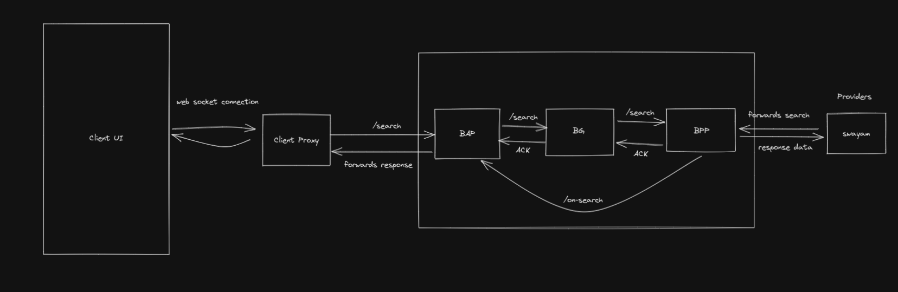

## DSEP - Trainings and Courses
This project provides open interoperable specifcations for creating decentralized skills and education networks. It is an adaptation of beckn protocol core specification with added taxonomies and sample network policies for the skills and education sector.

This repository is specifically for Training and Courses.

## Blocks


## Code Stucture
The code is stuctured as follows

1. [Beckn BAP](https://github.com/Samagra-Development/dsep/tree/master/apps/bap)
2. [Beckn BG](https://github.com/Samagra-Development/dsep/tree/master/apps/bg)
3. [Beckn BPP](https://github.com/Samagra-Development/dsep/tree/master/apps/bpp)
4. [Mock Provider (Swayam)](https://github.com/Samagra-Development/swayam-wrapper)
5. [BAP Client Proxy](https://github.com/Samagra-Development/dsep-ui/tree/master/apps/client-proxy) - Acts as a service connecting Client and Proxy
6. [BAP Client](https://github.com/Samagra-Development/dsep-ui) - A course search page

## Installation

```bash
$ npm install
```

## Running the app

```bash
# development
$ npm run start

# watch mode
$ npm run start:dev

# production mode
$ npm run start:prod
```

## Work Around
```bash
# In case server doesn't start with the above command than execute the following commands on separate terminal
$ npx yarn start bap
$ npx yarn start bg 
$ npx yarn start bpp
```

## Test

```bash
# unit tests
$ npm run test

# e2e tests
$ npm run test:e2e

# test coverage
$ npm run test:cov
```

## Support

This repository is an MIT-licensed open source project.

## Stay in touch

- Author - [Yash Mittal](https://github.com/techsavvyash)

## License

Nest is [MIT licensed](LICENSE).
