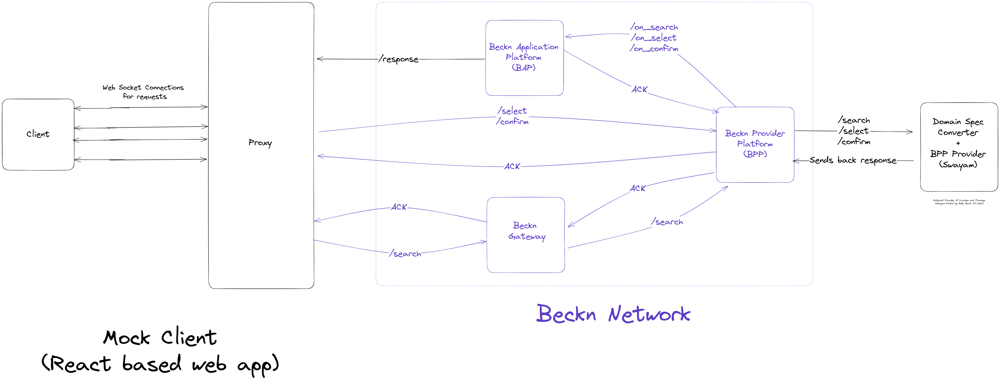

# SkillEd: Trainings and Courses

This doc underlines the architectural implementational details of reference **Beckn Provider Platform (BPP)** implementation for the **Courses and Training** track complaint to **DSEP spec v1.0.0.**

### Deployment and Network Registration Details

The reference BPP implemented in this repository is onboarded on the `Beckn Gateway` and `Beckn Gateway Registry` under the `Courses and Trainings` category.

- [**BPP Deployed URL**](https://bpp.dsep.samagra.io)
- [**BAP Deployed URL**](https://bap.dsep.samagra.io)
- **BPP Network Participant Id**: bpp.dsep.samagra.io
- [Network Participant Information on Beckn Registry](https://registry.becknprotocol.io/network_participants/index/network_participants/show/430)

## Tech Stack

**Programming Language**: TypeScript
**Framework**: NestJS
**Database**: Postgres exposed via Hasura
**Runtime**: Node v16.19.0

## Project Organisation

This reference implementation contains all three network participants, i.e. **Beckn Provider Platform**, **Beckn Gateway**, **Beckn Provider Platform**, organised as a **NestJS Monorepo**.

### Directory structure

```bash
.
├── apps
│   ├── bap
│   ├── bg
│   └── bpp
├── docs
│   └── examples
├── tsconfig.build.json
├── tsconfig.json
├── types
│   └── schema.ts
├── utils
│   ├── generators.ts
│   ├── types.ts
│   └── utils.ts
├── nest-cli.json
├── package.json
├── README.md
└── yarn.lock
```

The `apps` directory contains the actual apps for each network participant
`apps/bap` and `apps/bg` contains the code for a sample `Beckn Application Platform` and `Beckn Gateway` respectively for testing the `Beckn Provider Platform`.

More details about each network participant and their implementation can be found their following directories here as:

- [Beckn Application Platform (BAP)](https://github.com/Samagra-Development/dsep/blob/master/apps/bap/README.md)
- [Beckn Gateway(BG)](https://github.com/Samagra-Development/dsep/blob/master/apps/bg/README.md)
- [Beckn Provider Platform (BPP)](https://github.com/Samagra-Development/dsep/blob/master/apps/bpp/README.md)

## Architecture



## Features & User workflow

The reference app is a **Course Discovery Platform** that talks in **Decentralised Skilling and Education Protocol** and curates courses from various providers like, **Swayam Portal**, **MIT OCW**, **Udemy**, etc., right now only swayam is onboarded as a provider, other platforms can be easily onboarded onto the BPP.

The `/search` request is forwarded to the `Beckn Gateway` with the domain of `dsep:courses` so that reaches our reference `BPP`. The `BPP` then forwards the `search` request to the `Swayam Provider Wrapper` which translates the `Beckn` compliant search request into a search query compatible to be forwarded to the `Swayam Portal` and fetches the result from there. The fetched results are then again converted in `Beckn /on_search` compliant response and forwarded to the `BPP`, which then calls the `/on_back` endpoint on the `bap_uri` present in the search requests's `context`. The sample `BAP` implementation for the demonstration of end to end flow right now, forwards the request to the `client proxy` which determines which client the request belongs to based on the `message_id` and `transaction_id` in the context of the `on_search` request and forwards the response to the concerned client.
The `client` and `client proxy` are connected together via a websocket connection using `redis` and `socket.io` to create a `publish-subscribe` model to support the **asynchronous nature** of `Beckn APIs`. (To learn more about the Beckn APIs and their structure refer the [official Beckn Protocol Website](https://https://becknprotocol.io/))

### Supported Methods

**/search:** This method/endpoint allows for searching of courses and training via a direct DSEP complaint request to the BPP using the context.domain as `dsep:courses`

**/select**: This method/endpoint is allows for selecting some courses or trainings to be enrolled in/purchased by the user. The context domain for this method should be `dsep:courses`. In the reference course discovery platform implementation this endpoint is called when expanding a particular course to view its details.

**/init**: This method/endpoint is allows for initiating purchasing a course or training by getting a quote from the provider and entering personal details required for enrollment. The context domain for this method should be `dsep:courses`.

**/confirm**: This method/endpoint indicated the confirmation of an order after successful payment/enrollment. In the reference course discovery platform implementation this endpoint is called when visiting the course on the external website.

## Local installation

Follow the following steps to setup the monorepo locally on your system.

1. Clone the repository

   ```bash
   git clone https://github.com/Samagra-Development/dsep
   ```

2. Navigate into the directory where you have cloned the repository

```bash
cd /path/to/cloned/repository
```

3. Install the required dependencies using the package manager of your choice (yarn preferred).

   ```bash
   yarn install
   ```

4. Create a `.env` file similar to the `.env,sample` file and populate it with required credentials
5. [Install Docker](https://docs.docker.com/engine/install/), [Install Docker Compose](https://docs.docker.com/compose/install/linux/), and run

   ```bash
   docker compose up
   ```

6. Navigate to your hasura UI which will be started after running the command in `Step 5` and create a table named `dsep_courses`.
7. Run the services for the required network participant using the following commands

   ```bash
   yarn start <bap | bg | bpp> # replace <bap | bg | bpp> with a single name
   # for example: yarn start bpp will start the BPP
   ```

Or start all of them together using
`bash yarn start:all # this will start all the services `

## Deployment

1. [Install Docker](https://docs.docker.com/engine/install/), [Install Docker Compose](https://docs.docker.com/compose/install/linux/), and run

   ```bash
   docker compose up
   ```

2. PM2 Based Deployment

   ```bash
   yarn build
   pm2 start dist/apps/bpp/main.js --name beckn-bpp
   pm2 start dist/apps/bap/main.js --name beckn-bap
   pm2 start dist/apps/bg/main.js --name beckn-bg
   ```

## Cypress Testing

1. Install the required dependencies using the package manager of your choice (yarn preferred).

   ```bash
   yarn install
   ```
   This command will install all the necessary dependencies defined in the package.json file, including Cypress.

2. Run the Cypress tests in the terminal. This will execute the tests in headless mode and output the results to the console.

    ```bash
    npx cypress run
    ```

   The Cypress Test Runner will start running the tests and display the test results and logs in the terminal.

   Alternatively, you can open the Cypress Test Runner in a separate interface to run and view your tests:

    ```bash
    npx cypress open
    ```

    This command will open the Cypress Test Runner, which provides a graphical interface to manage and execute your Cypress tests.

   From the Test Runner, you can select a specific test file or run all tests. It also provides real-time reloading of tests as you make changes, allowing for a faster development workflow.

   Cypress Test Runner also offers additional features like debugging, screenshots, and video recording of test runs.

3. Follow the instructions provided by the Cypress Test Runner to interact with and inspect the tests.

   * To run a specific test or test suite, click on the corresponding file or test case in the Cypress Test Runner.
   
   * The Test Runner will automatically open a browser window and execute the selected test(s) within it.
   
   * You can view the test execution, logs, and assertions in the Test Runner interface.

   * To debug your tests, set breakpoints in your test code, and use the Cypress DevTools to inspect the application under test.


## Related Repositories

- [Mock Provider (Swayam)](https://github.com/Samagra-Development/swayam-wrapper)
- [BAP Client Proxy](https://github.com/Samagra-Development/dsep-ui/tree/master/apps/client-proxy) - Acts as a service connecting Client and Proxy
- [BAP Client](https://github.com/Samagra-Development/dsep-ui) - A course search page

## Adding Services to Beckn Registry

Follow [this guide](https://github.com/sanjay95/BECKN-Integration-to-Gateway/blob/main/README.md) to onboard yourself on the Beckn Registry.

## Resources to know more about DSEP and Beckn

- [Beckn Official Website](https://becknprotocol.io)
- [Core DSEP Specification](https://github.com/beckn/protocol-server/blob/v2/schemas/core.yaml)

## Stay in touch

- Author: [Yash Mittal](https://github.com/techsavvyash)
- Mentor on the project: [Chakshu Gautam](https://github.com/ChakshuGautam)
````
